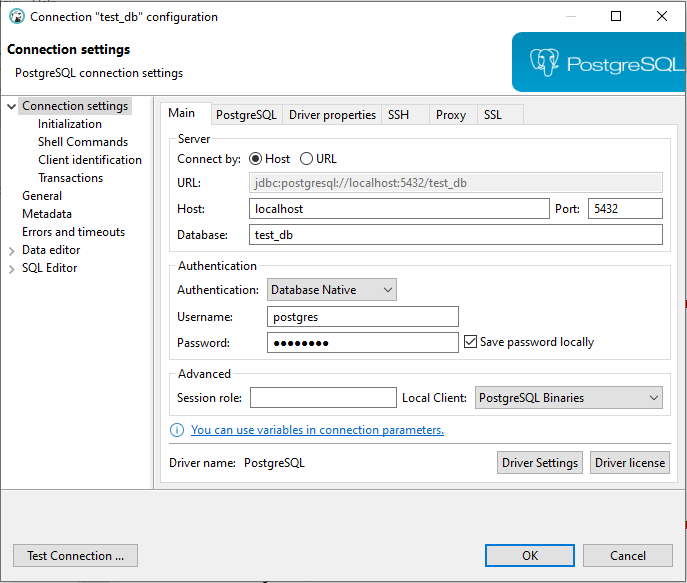

# Votação API REST

---

* **Objetivo**

O sistema consiste em ser uma solução para gerenciar votações de pautas sobre qualquer assunto, ajudando de uma forma mais prática e fácil.

---

* **Preparando o ambiente**

É necessário baixar o Docker Desktop -> https://www.docker.com/products/docker-desktop/
depois vá na raiz do projeto vai ver o arquivo docker-compose.yml, usando qualquer cmd
na pasta onde se encontra o arquivo digite **docker-compose up** depois verifique se a imagem do postgreSql apareceu.

---

Também é necessário uma ferramenta de SGBD, ou qualquer outra do seu gosto, abaixo segue o link:
https://dbeaver.io/download/

Abrir o DBeaver e criar nova conexão.
Na janela que abrir, deve ser inserida as informações da conexão nos campos:

 - a) Host: localhost
 - b) Database: test_db
 - c) Port: 5432
 - d) Username: postgres
 - e) Password: postgres



---

### Endpoints

Swagger

http://localhost:8080/swagger-ui/index.html#/

---

Postman

* **POST**<br />
Criar uma pauta http://localhost:8080/pauta/create <br />Exemplo payload
```
 {
        "pauta": "pauta lei 4.2.1"
        
    }
```
Criar uma sessão de votação http://localhost:8080/voting-session/create/{idPauta} <br />Exemplo payload
```
{
  "dateClosing": "2023-04-21T10:07:51.432Z"
}
```
Registrar seu voto na pauta http://localhost:8080/vote/register/{idPauta} <br />Exemplo payload
```
{
  "cpfAssociado": "878.740.080-49",
  "messageVote": "NÃO"
}
```

---
Esse endpoint é integrado com outro sistema externo

Enviar o resultado da votação para o serviço de mensageria http://localhost:8080/pauta/send-kafka/{idPauta}

---

* **GET**<br />Pegar o resultado da votação http://localhost:8080/pauta/result/{idPauta}

---

### Exemplos do core da Votação API
Esse método consiste em criar uma sessão se a pautar existir e também verefica se a sessão de pauta já existe. Pegando o LocalDateTime.now() a hora que abro a sessão e no caso se eu não escolher o tempo de fechamento da sessão ele por defaut vai ser 60 segundos.Também tem verificação se o usuário colocar uma data de fechamento antes da data atual.

```
@Override
    public VotingSessionResponse openSession(Integer idPauta, VotingSessionRequest votingSessionRequest) {

        Pauta pauta = pautaService.findByIdPauta(idPauta);

        if (votingSessionRepository.findByPauta(pauta).isPresent()) {
            throw new BusinessException("Sessão de votação já existe!");
        }

        VotingSession votingSession = sessionMapper.toVotingSession(votingSessionRequest);
        votingSession.setDateOpen(LocalDateTime.now(ZoneId.of("America/Sao_Paulo")));
        votingSession.setPauta(pauta);

        if (votingSession.getDateClosing() == null) {
            votingSession.setDateClosing(LocalDateTime.now(ZoneId.of("America/Sao_Paulo")).plusSeconds(DEFAULT_TIME_VOTING));
            log.info("Tempo padrão na sessão foi ativada!");
        }


        if (votingSession.getDateClosing().isBefore(LocalDateTime.now(ZoneId.of("America/Sao_Paulo")))) {
            throw new BusinessException("Data de fechamento não pode ser antes da Data de abertura da Sessão!");
        }

        votingSessionRepository.save(votingSession);
        log.info("Sessão criada com sucesso!");

        return sessionMapper.toVotingSessionResponse(votingSession);
    }
```

---

Esse método consiste em votar na pauta, verificando se a votação tá fechada ou aberta, se tiver aberta então digite seu cpf e digite Sim ou Não para votar. Claro que o usuário só pode votar uma vez, então tem a vefiricação com o voteRepository.existsByVotingSessionAndCpfAssociado pra saber se já tem voto com esse cpf.
```
@Override
    public VoteResponse vote(Integer idPauta, VoteRequest voteRequest) {
        VotingSession votingSession = votingSessionService.getVotingSession(pautaService.findByIdPauta(idPauta));

        if (LocalDateTime.now().isAfter(votingSession.getDateClosing())) {
            throw new BusinessException("Sessão de votação já está fechada!");
        }

        Vote vote = voteMapper.toVote(voteRequest);

        if (voteRequest.getMessageVote().equalsIgnoreCase("Sim")) {
            vote.setMessageVote(MessageVote.SIM);
        } else if (voteRequest.getMessageVote().equalsIgnoreCase("Não")) {
            vote.setMessageVote(MessageVote.NAO);
        } else {
            throw new BusinessException("Valor digitado incorreto! vote Sim ou Não");
        }
        vote.setVotingSession(votingSession);
        vote.setDateVote(LocalDateTime.now(ZoneId.of("America/Sao_Paulo")));

        if (voteRepository.existsByVotingSessionAndCpfAssociado(votingSession, vote.getCpfAssociado())) {
            throw new BusinessException("CPF Associado já tem registrado voto nessa pauta!");
        }

        voteRepository.save(vote);
        log.info("Voto salvo com sucesso!");

        return voteMapper.toVoteResponse(vote);
    }
```

---
Esse método consiste em pegar o resultado da votação só quando a sessão de votação estiver fechada. no caso pega a hora de agora e se for antes do fechamento da sessão, ocorre a excessão. Então pegando a lista de votos da sessão e filtrando os que votou Sim ou Não.
```
@Override
    public ResultResponse resultVoting(Integer idPauta) {
        Set<Vote> votesList = votingSessionService.getVotingSession(pautaService.findByIdPauta(idPauta)).getVotes();
        Pauta pauta = pautaService.findByIdPauta(idPauta);

        VotingSession votingSession = votingSessionService.getVotingSession(pautaService.findByIdPauta(idPauta));

        if (LocalDateTime.now(ZoneId.of("America/Sao_Paulo")).isBefore(votingSession.getDateClosing())) {
            throw new BusinessException("Sessão ainda está aberta! não é possível ver ou enviar o resultado da votação");
        }

        Map<String, Long> resultMap = new HashMap<>();
        resultMap.put("SIM", votesList.stream().filter(x -> x.getMessageVote().toString().equalsIgnoreCase("SIM")).count());
        resultMap.put("NAO", votesList.stream().filter(x -> x.getMessageVote().toString().equalsIgnoreCase("NAO")).count());

        ResultResponse resultResponse = new ResultResponse();
        resultResponse.setPauta(pauta.getPauta());
        resultResponse.setResultado(resultMap);

        return resultResponse;
    }
```

---

Agora o método que consiste em pegar o resultado da votação e enviar para o sistema de mensageria sendo possível com @FeingClient fazendo integração com o outro sistema e assim distribuindo a informação para o restante da plataforma.

```
@FeignClient(name = "result-kafka-api", url = "${application.client.result-kafka-api.url}")
public interface ResultKafkaApiClient {
    @PostMapping(consumes = MediaType.APPLICATION_JSON_VALUE)
    void sendResult(@RequestBody List<ResultRequest> resultRequests);
}


@Override
    public void sendKafkaResultVoting(Integer idPauta) {
        ResultResponse resultResponse = resultVoting(idPauta);
        ResultRequest resultRequest = resultMapper.toRequestResult(resultResponse);

        List<ResultRequest> resultRequestsList = new ArrayList<>();
        resultRequestsList.add(resultRequest);

        resultKafkaApiClient.sendResult(resultRequestsList);
    }
```


